# MuCoSim: Analysis of a Compressible Lattice Boltzmann Solver (CLBM); Focusing Energy and Power Consumption 

## Table of Contents
1. [Project Description](#1-project-description)  
    [1.1 General Info](#11-general-info)  
    [1.2 Application Info](#12-application-info)  
    [1.3 Testsystem](#13-testsystem)  
    [1.4 Software Environment](#14-software-environment)  
    [1.5 How to build software](#15-how-to-build-software)  
    [1.6 Test case description](#16-test-case-description)  
    [1.7 How to run software](#17-how-to-run-software)  
2. [Task1: Scaling runs](#2-task1-scaling-runs)  
3. [Task2: Whole application measurements](#3-task2-whole-application-measurements)  
    [3.1 Energy Delay Product (EDP)](#31-energy-delay-product-edp)  
4. [Task3: Runtime profile](#4-task3-runtime-profile)  
5. [Task4: Instrument kernels with MarkerAPI](#5-task4-instrument-kernels-with-markerapi)
6. [Task5: Measurements of the selected hot spots](#6-task5-measurements-of-the-selected-hot-spots)  
7. [Task6: Discussion of hot spot measurements](#7-task6-discussion-of-hot-spot-measurements)  
[Reference](#reference)  
[Appendix](#appendix)

## 1. Project Description

### 1.1 General Info

-   Name : **Sudesh Rathnayake**
-   Marticulation Number : **22849910**
-   Email : <sudesh.rathnayake@fau.de>

### 1.2 Application Info

Code: CLBM  
URL:[git\@gitlab.cs.fau.de:yh54ojyn/mucosim.git](git@gitlab.cs.fau.de:yh54ojyn/mucosim.git)

The Compressible Lattice Boltzmann (CLBM) solver is aimed at simulating
supersonic flows to observe the strong shock formations in compressible
media. This solver was developed for a collaborative master’s thesis
project between the departments of system simulation at
Friedrich-Alexander-Universität Erlangen-Nürnberg and Fraunhofer
Ernst-Mach-Institut.  
Most of the time, the Lattice Boltzmann Method (LBM) adopts a structured grid in
practice. A structured grid is represented by a regular grid where
points on the grid are updated together, and it has high spatial locality [1].   

<figure>
    <center>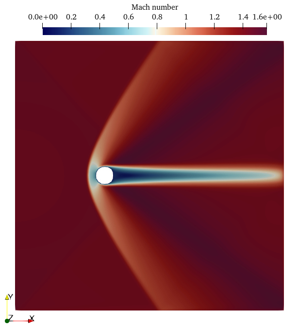
    <figcaption>Simulation of compressible flow over a 2D cylinder using CLBM</figcaption></center>
</figure>

In conventional LBM, a single distribution function is utilized in one
lattice node to represent mass and momentum conservation when
approximating incompressible Navier-Stokes Equations. However, the
Double Distribution Function (DDF) approach, also known as the
two-population method, is a popular choice for thermal Lattice Boltzmann
simulations, and later, for compressible Lattice Boltzmann simulations[3].
For instance, considering 2D, there are two set of discrete distribution
functions with nine elements for each in single D2Q9 standard stencil.
Further, the CLBM incorporates the Entropic Lattice Boltzmann Method (ELBM) where several approximations are necessary compared to the standard
Incompressible LBM. Therefore, it is worth investigating the performance
of the newly developed CLBM application.

### 1.3. Testsystem

-   Host/Clustername: Fritz
-   Cluster Info URL: <https://hpc.fau.de/systems-services/documentation-instructions/clusters/fritz-cluster/>
-   CPU type: 2x Intel Xeon Platinum 8360Y @ 2.4 GHz
-   Number of cores per node: 72
-   Memory capacity: 256 GB

### 1.4. Software Environment

-   Compiler: GNU c++ compiler (g++)
-   OpenMP
-   Operating System: Ubuntu 20.04.3 LTS
-   Addition libraries:
    -   GSL-GNU Scientific Library
    -   LIKWID 5.3.0

### 1.5. How to build software

All the required libraries, directories and relevant compiler directives
are defined in the CMakeLists.txt file. After logging in to Fritz the CLBM solver can be built using the following commands. Furthermore, to observe the proper linking of libraries and compiler directives, `make VERBOSE=1` can be used.   
```
$ module load cmake
$ module load likwid
$ module load gsl
$ git clone git@gitlab.cs.fau.de:yh54ojyn/mucosim.git
$ cd mucosim
$ cd <2D/3D case>
$ cd build
$ cmake ..
$ make
```
In CMakeLists.txt file, the following compiler optimization flags have been set for the g++ compiler.

- `-O3`: Highest optimization level
- `-march=native`: Optimize code for a given architecture
- `-mavx`: Enables support for AVX (Advanced Vector Extensions)
- `-ftree-vectorize`: Enable loop vectorization

### 1.6. Test case description

A 2D shock tube simulation setup is considered for the present performance analysis. The solver output for a given input parameters is validated before doing the performance analysis to check the correctness of the solver. Furthermore, there are no obstacles present inside the shock tube. All the input parameters are defined in the `input_parameters_ST_2.txt` file. For the analysis, the following input properties are used for a 3000x3000, 2D computational domain. As mentioned in 1.2 the standard D2Q9 lattice stencil is utilized.
```
input_file              input_parameters_ST_2.txt
vtk_out_name_base       ST_2_
part_out_name_base      ST_2_
vtk_out_freq            100  
part_out_freq; 	        1000
domain_size_x           2998
domain_size_y           2998
domain_size_z           1
helper_cells            2
total_time              300
fluid_flag              0
Prandtl_number          0.71
sphr                    1.4
u_x                     0.0
u_y                     0.0
u_z                     0.0
kinematic_viscosity     0.015
x_shift_velocity        0.0
rho_l                   1.0
rho_r                   0.125
T_l                     0.15
T_r                     0.12
```
**Note**: The following simulation domain size is obtained after performing a single-core performance analysis of a Fritz node. According to analysis, it is found that the domain size should be approximately more than 500x500 to avoid high OpenMP overhead. Furthermore, it is advised that the run time should be at least more than 10 minutes to obtain accurate power and energy measurements using `likwid-perfctr`. Therefore, the simulation domain size is selected as 3000x3000 lattice nodes along the X and Y axes.

### 1.7 How to run software

After building the application as mentioned in section 1.5, following steps can be used to run the CLBM application.

```
$ module load likwid
$ module load gsl
$ cd mucosim
$ cd 2D_SHOCK_TUBE
$ cd build
$ export OMP_NUM_THREADS= X ./CLBM
```
However, when obtaining all the performance measurements, job scripts are submitted according to the Slurm batch system. Information regarding the basic usage of the Slurm batch system can be found at <https://hpc.fau.de/systems-services/documentation-instructions/batch-processing>. The exemplary usage of batch scripts used in the present analysis can be listed as follows.
```sh
#!/bin/bash -l
#SBATCH --job-name=CLBM
#SBATCH --partition=singlenode
#SBATCH --nodes=1
#SBATCH --ntasks-per-node=1
#SBATCH --cpus-per-task=1
#SBATCH --time=24:00:00
#SBATCH --export=NONE
#SBATCH --constraint=hwperf
#SBATCH --output=/home/%j_%x.out
unset SLURM_EXPORT_ENV 
module load gsl
module load likwid
# This pins openMP threads to physical cores on the socket
export OMP_PLACES=cores
# This places threads as close as possible to one another
export OMP_PROC_BIND=true

export OMP_NUM_THREADS=72
srun --cpu-freq=2400000-2400000:performance likwid-perfctr -C S0:0-35@S1:0-35
  -g MEM_DP -m ./CLBM
```

## 2. Task1: Scaling runs

Usually, the performance matric for the LBM simulations is taken as the Mega Lattice Updates per seconds (MLUP/s). The `MLUP/s` is calculated using the output of the CLBM application. 
```
3000    3000    runtime_in_seconds    MLUP/s
``` 
The obtained performance in `MLUP/s` versus the number of cores is shown in the following figure 2. According to the presented strong scaling results, the performance saturates in 1<sup>st</sup> NUMA domain, and then it scales linearly.

<figure>
    <center>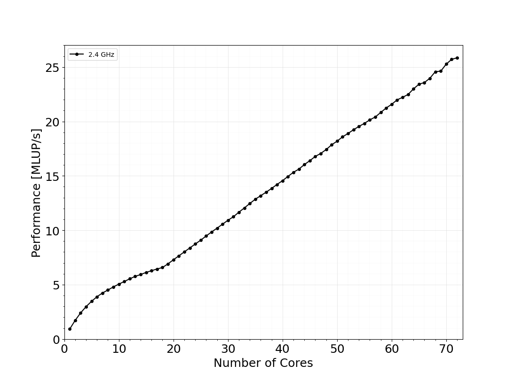
    <figcaption>Number of cores versus performance in MLUP/s</figcaption></center>
</figure>

<figure>
    <center>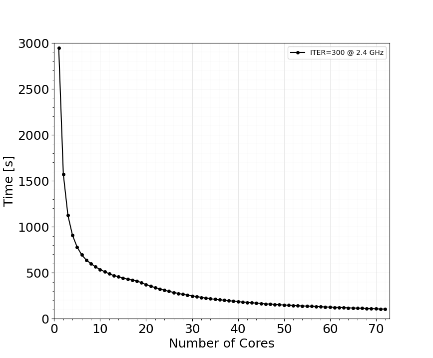
    <figcaption>Number of cores versus execution time in seconds</figcaption></center>
</figure>

<br>
The figure 3 represent the simulation time for 300 lattice time steps at 2.4 `GHz`. In the next sections, several measurements are obtained by using `likwid-perfctr` to draw some conclusions about the whole application and selected hotspots of the applications.  
<!-- <br>
<br>
<br>
<br>
<br>
<br>
<br>
<br>
<br>
<br>
<br>
<br>
<br>
<br> -->


## 3. Task2: Whole application measurements

The main aim of this study is to investigate the energy efficiency and power consumption of the present CLBM implementation. Therefore, the main LIKWID performance group used in this study is `MEM_DP`. An exemplary output from the `MEM_DP` group is shown in the following listing.  
```
likwid-perfctr -C S0:0 -g MEM_DP -m ./CLBM
+-----------------------------------+------------+
|               Metric              | HWThread 0 |
+-----------------------------------+------------+
|        Runtime (RDTSC) [s]        |  2974.8850 |
|        Runtime unhalted [s]       |  2961.7851 |
|            Clock [MHz]            |  2394.3449 |
|                CPI                |     0.7580 |
|             Energy [J]            | 40677.5900 |
|             Power [W]             |    13.6737 |
|          Energy DRAM [J]          | 23610.0800 |
|           Power DRAM [W]          |     7.9365 |
|            DP [MFLOP/s]           |  1199.3221 |
|          AVX DP [MFLOP/s]         |    77.7390 |
|          Packed [MUOPS/s]         |    19.4347 |
|          Scalar [MUOPS/s]         |  1121.5832 |
|  Memory read bandwidth [MBytes/s] |  9752.9123 |
|  Memory read data volume [GBytes] | 29013.7925 |
| Memory write bandwidth [MBytes/s] |  1816.0125 |
| Memory write data volume [GBytes] |  5402.4282 |
|    Memory bandwidth [MBytes/s]    | 11568.9248 |
|    Memory data volume [GBytes]    | 34416.2207 |
| Operational intensity [FLOP/Byte] |     0.1037 |
|      Vectorization ratio [%]      |     1.7033 |
+-----------------------------------+------------+
```  

Here, all the relevant measurements for the present study can be extracted such as,

-   Memory bandwidth (MBytes/s)
-   Energy (J)
-   Power (W)
-   Energy DRAM (J)
-   Power DRAM (W)
-   Double precision; DP performance (MFlop/s)
-   Operational intensity (Flop/Byte)

However, there are some separate  performance groups in `likwid-perfcter` to measure energy  and memory bandwidth, such as `ENERGY`, `MEM` if relevant. Initially, the memory bandwidth, total energy, total power consumption, DRAM energy and DRAM power of the whole application are measured with varying numbers of cores in one Fritz node. According to figures 4–8,  the following observations can be made considering the whole application.

-   Memory bandwidth also saturates in 1<sup>st</sup> NUMA domain. At saturation, it is approximately 75.5 GB/s. Further, according to the strong scaling results, the maximum attainable performance using a full node is ~25 `MLUP/s` and the maximum attainable memory bandwidth is close to 290 `GB/s`.
-   Energy measurements have been obtained for several frequencies ranging from 1.8 `GHz` to 3.0 `GHz` with an increment of 0.2 `GHz`. It is because, to investigate the optimal frequency or frequency for the present implementation in terms of energy.
-   In energy and power measurements, there is an unusual behavior in the single-core measurements. This behavior can be reproduced consistently for several data samples. However, the proper energy variation can be observed for 2.2 `GHz` consistently for several data samples.  `likwid-powermeter` also produced the same variations.
-   The energy values have a saturating optimum point at 1<sup>st</sup> NUMA domain before reaching a second optimum point at 1<sup>st</sup> socket.
-   Sudden energy jumps when moving to the second socket before decreasing in a quite linear fashion in the second socket. Likewise, a sudden power jump can be observed for the power measurements too. 
-   Usually, DRAM energy contributes a considerable portion to the total energy consumption. Therefore, the contribution from the DRAM energy and power is also investigated.
-   As in the total energy measurements, the unexpected data point at the beginning of the energy and power measurements cannot be observed for the DRAM energy and power measurements. However, the DRAM energy and power trends follow the same trend as the total energy and power measurements, except for a slight saturation in DRAM power measurements in 1<sup>st</sup> NUMA domain.
-   2.2 `GHz` shows the lowest energy curve for a wider domain across the node.
-   The frequencies (`GHz`) 1.8, 2.0, 2.2, and 2.4 show the lowest CPU energy measurements while having approximately the same energy values in the first socket. For instance, at 18<sup>th</sup> core 2.4 `GHz` has the lowest total energy, and at  36<sup>th</sup> core 1.8 `GHz` shows the lowest total energy value.
-   Surprisingly, the DRAM energy contribution to the total energy is in the range of 5%–11%.
<!-- <br>
<br>
<br>
<br>
<br>
<br>
<br>
<br> -->

<figure>
    <center>
    <figcaption>Number of cores versus memory bandwidth in GB/s</figcaption></center>
</figure>

<!-- <br>
<br>
<br>
<br>
<br>
<br>
<br>
<br> -->

<figure>
    <center>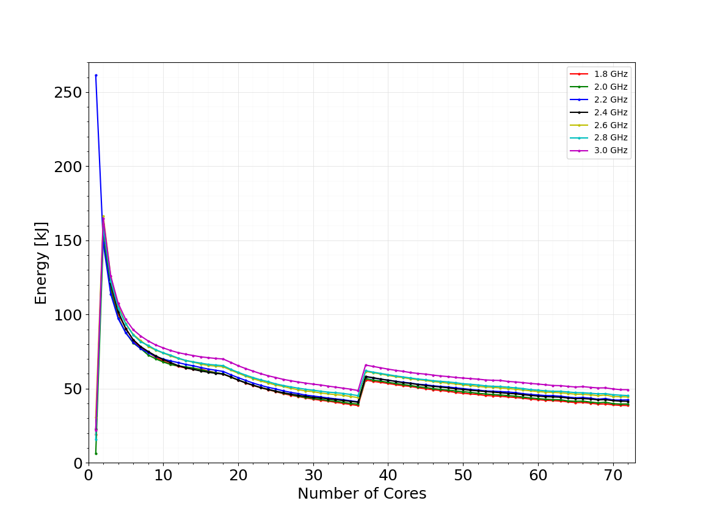
    <figcaption>Energy measurements in one node</figcaption></center>
</figure>

<figure>
    <center>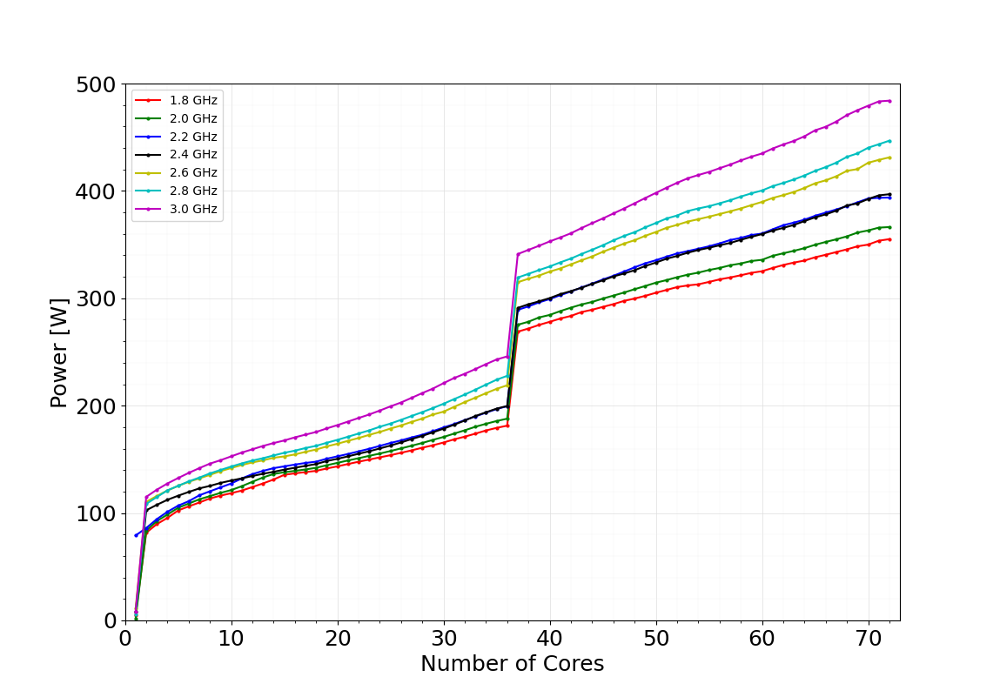
    <figcaption>Power measurements in one node</figcaption></center>
</figure>

<figure>
    <center>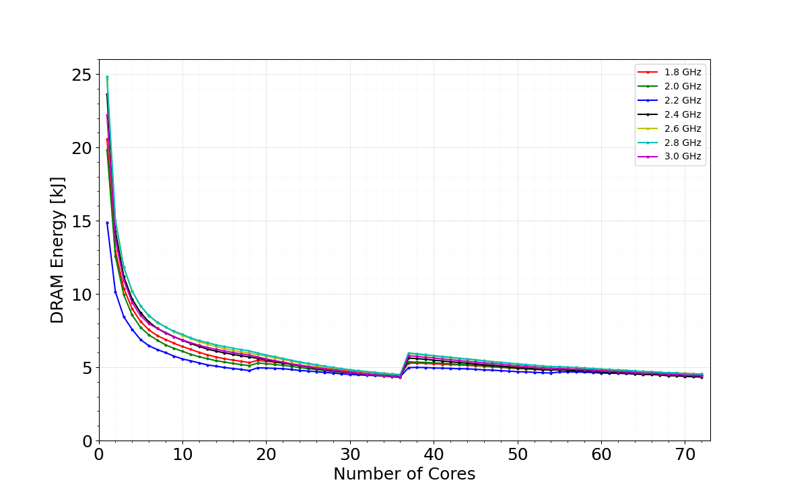
    <figcaption>DRAM Energy measurements in one node</figcaption></center>
</figure>

<figure>
    <center>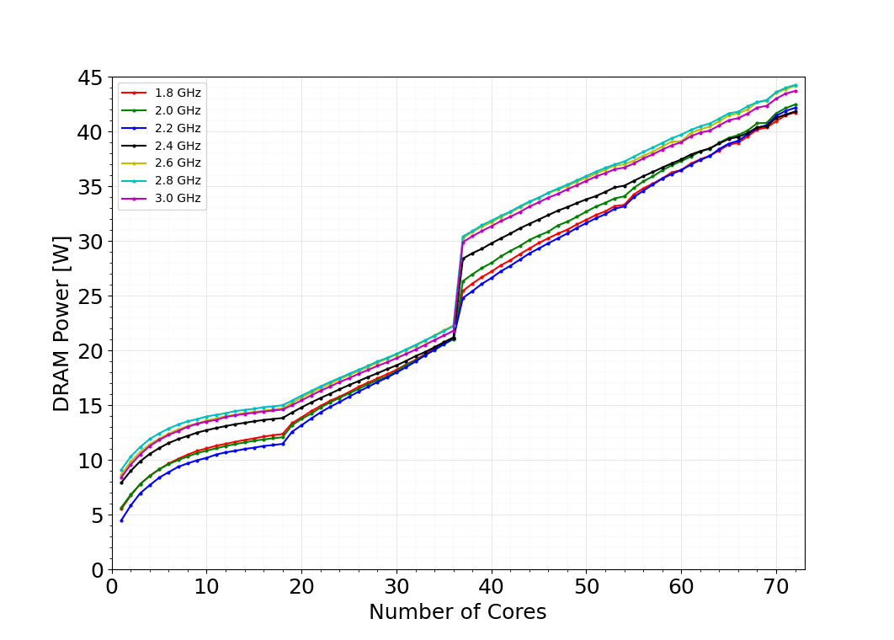
    <figcaption>DRAM Power measurements in one node</figcaption></center>
</figure>

### 3.1 Energy Delay Product (EDP)

Energy-to-solution and the energy-delay product (EDP) constitute the fundamental metrics for measuring energy efficiency [2], [5]. EDP for a given application can be obtained by using `Z`-plots. Typically, `Z`-plots represents the energy to solution versus a suitable performance metric. EDP is the gradient of a line passing through the `Z`-plot [4]. As mentioned in some of the literature, energy efficiency increases with decreasing EDP [2], [5].  
Therefore, to observe the EDP, a `Z`-plot is constructed as shown in figure 9, for the above-mentioned frequency range. The `MLUP/s` is taken as the performance metric. Furthermore, energy and performance measurements at the first socket are considered when constructing the `Z`-plot. It is because, according to previous observations, the lowest energy point for the whole application is observed at the first socket in the Fritz node.  
Figure 9 shows the acquired EDP values at the first NUMA domain and at the first socket. Here, the EDP values are related to the 2.4 `GHz`. According to the observations, it is evident that with the increasing core count, the EDP values decrease for the CLBM application. Further, this behaviour is quite common in most of the modern architectures [2]. However, considering figure 10, it is evident that the frequencies 1.8–2.4 `GHz` approximately lie on the same EDP gradient. Therefore, the CLBM application shows the highest energy efficiency at first socket in Fritz node and optimal frequencies in terms of energy efficiency can be 1.8–2.4 `GHz`.

<figure>
    <center>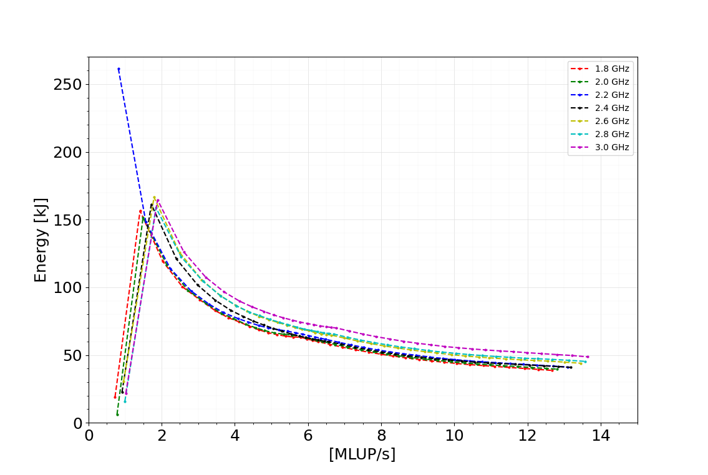
    <figcaption>Z-plot considering one socket in a Fritz node.</figcaption></center>
 </figure>

 <figure>
    <center>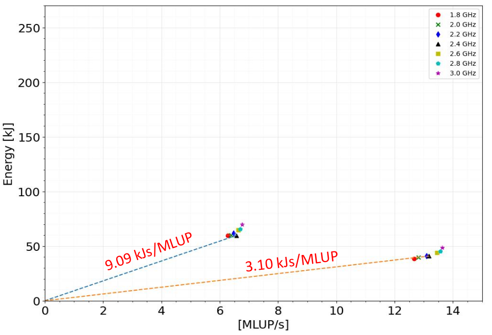
    <figcaption>EDP related to 18 and 36 cores at 2.4 GHz</figcaption></center>
 </figure>

## 4. Task3: Runtime profile

To obtain the runtime profile of the application, the `VTune` profiler is utilized. After getting into the build directory, the following steps can be used to get a runtime profile for the application.
```
$ module load vtune
$ vtune -collect hotspots -result-dir hotspots_CLBM ./CLBM
```
Thereafter, the results files inside the `hotspots_CLBM` directory can be opened using `vtune-gui`. The following table lists the hotspots provided by the summary tab in `vtune-gui`.    
```
| Functions                   | Module| CPU Time  | % of CPU Time  |
| --------------------------- |-------| --------- | ---------------|
| stream._omp_fn.18           | CLBM  | 769.654s  | 9.9%           |
| collision._omp_fn.12        | CLBM  | 685.792s  | 8.8%           |
| resetDDFshifts._omp_fn.14   | CLBM  | 631.249s  | 8.1%           |
| swap._omp_fn.14             | CLBM  | 591.541s  | 7.6%           |
| calcQuasiEqG._omp_fn.10     | CLBM  | 576.830s  | 7.4%           |
| [others]                    | N/A*  | 4508.774s | 58.1%          |
```
<sup>*</sup> N/A applied to non-summable metrics.

`Vtune` provides an extensive set of tools to analyse the code, which can be used to develop better implementation. For instance, during phase 1, the CLBM implementation showed bad strong scaling results. To obtain the better results as above, `Vtune` flame graph representations, detailed function call stack details helped to understand the underlying issues during phase 1.  
For instance, during phase 1, the top hotspot was the `expf4` function call, which helps to calculate an exponential function using the `math.h` library inside the `newtonRaphson` subroutine. Therefore, several changes have been done to optimize the `newtonRaphson.h` implementation to reduce the number of `expf4` function calls. The results obtained for the phase 1 can be seen in the presentation 1 and 2 in the Appendix section.  
According to the runtime profile analysis, the `stream`, `collision` and `newtonRaphson` subroutines have been selected for further investigations. According to the literature related to compressible DDF-LBM implementations, considerable attention was given to root-finding scheme considering the performance of respective DDF-LBM implementations[3]. Therefore, in this study, the `newtonRaphson` subroutine is selected even though it is not in the top hotspots.  
**Note**: Apart, from the code optimization in `newtonRaphson.h` several investigations have been carried out in terms of OpenMP scheduling, as well as OpenMP parallelization of several kernels which were not parallelized during phase 1.

## 5. Task4: Instrument kernels with MarkerAPI

After getting the runtime profile, the LIKWID MarkerAPI calls are placed around the hotspots to obtain the relevant measurements[7]. The MarkerAPI  calls are placed as shown in the following code snippet.
```c++
#include <likwid-marker.h> 

// initialize LIKWID MarkerAPI in a serial region.
LIKWID_MARKER_INIT;
// register a region name tag(=stream) to the Marker API
#pragma omp parallel
{
    LIKWID_MARKER_REGISTER("stream");

}

Data: Read computational grid and fluid properties;
Initialization: density, velocity, temperature and set temperature dependent weights;
Modification of c_i according to the shifted lattice velocity U ;
Calculate: f_eq ;
Estimate Lagrangian multipliers <-- Newton-Raphson ;
Calculate: g_eq and Initialize g, f ;
6 for (int i = 0; i < N umber of time steps; + + i)
{
    Calculate density, velocity, temperature and set temperature dependent weights;
    Calculate time dependent relaxation times;
    Write .vtk files for post-processing;
    Calculate f_eq ;
    Estimate Lagrangian multipliers <-- Newton-Raphson;
    Calculate g_eq ;
    Calculate pressure tensor;
    Calculate quasi-equilibrium distribution;
    Applying Knudsen number dependent stabilization;
    Collide;
    Reconstruction of f, g at grid nodes;
    Set boundary conditions;
    #pragma omp parallel
    {
    LIKWID_MARKER_START("stream");
    }
    Stream;
    #pragma omp parallel
    {
    LIKWID_MARKER_STOP("stream");
    }
    Swap f_new and f_old ;
}
// finalize the LIKWID MarkerAPI in a serial region.
LIKWID_MARKER_CLOSE;
```
As shown in the above code snippet, measurements for all the three kernels have been obtained by placing LIKWID MarkerAPI calls respectively. When using `likwid-perfctr`, the `-m` CLI switch activates the MarkerAPI[7].

## 6. Task5: Measurements of the selected hot spots

By using MarkerAPI calls, relevant measurements for the present study have been obtained following the same procedure as in Task 2. Here, the strong scaling results, memory bandwidth, energy consumption and power dissipation are measured. The DRAM energy and DRAM power measurements are not considered due to the less contribution towards the total energy contribution as observed in Task 2. 
Energy measurements have been obtained for three different frequencies, and remarks considering the hotspots will be discussed in Task 6.
<!-- <br>
<br>
<br>
<br>
<br>
<br> -->


<figure>
    <center>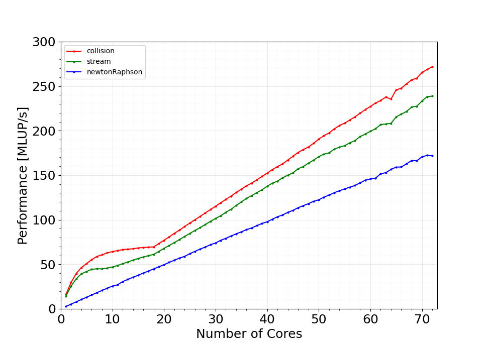
    <figcaption>Performance versus number of core count for selected hotspots</figcaption></center>
</figure>
<!-- <br>
<br>
<br>
<br>
<br>
<br>
<br>
<br>
<br>
<br>
<br>
<br> -->
<figure>
    <center>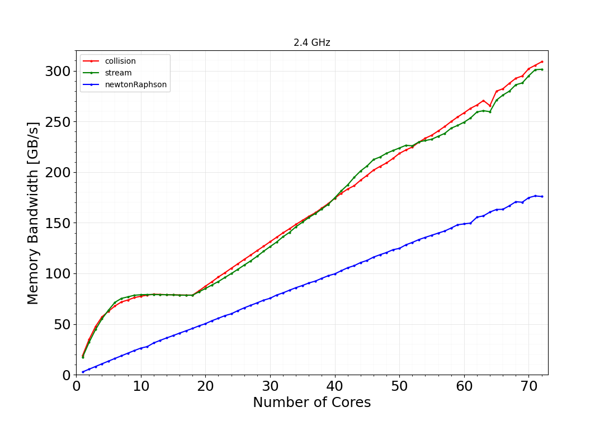
    <figcaption>Memory bandwidth versus number of core count for selected hotspots</figcaption></center>
</figure>

<figure>
    <center>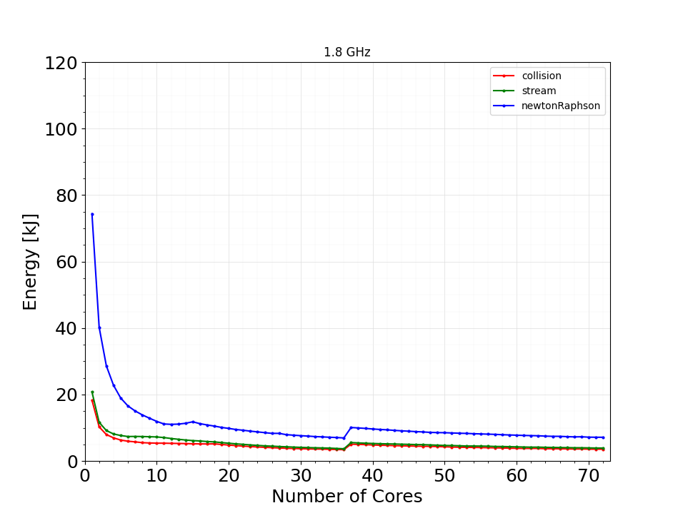
    <figcaption>Energy versus number of core count for selected hotspots at 1.8 GHz</figcaption></center>
</figure>

<figure>
    <center>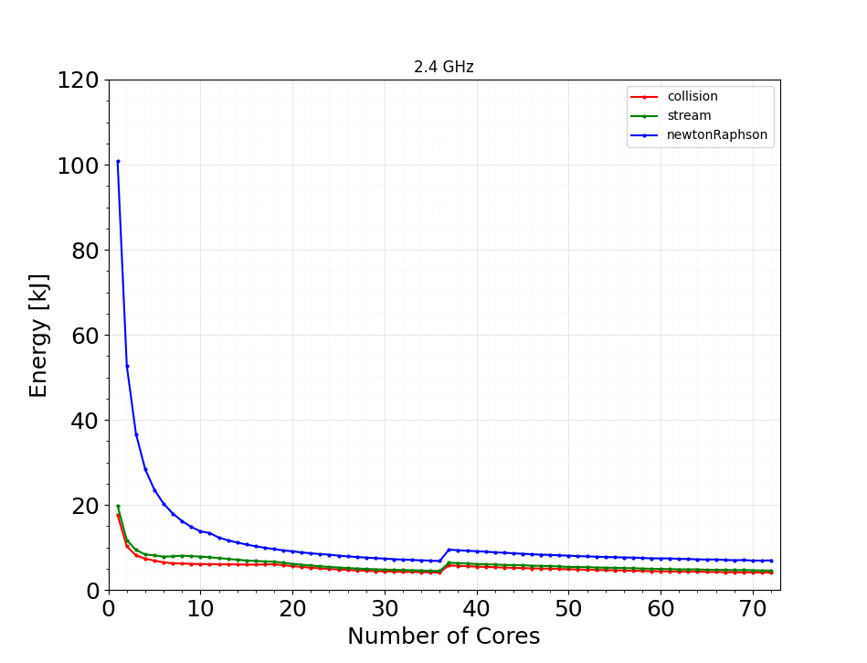
    <figcaption>Energy versus number of core count for selected hotspots at 2.4 GHz</figcaption></center>
</figure>

<figure>
    <center>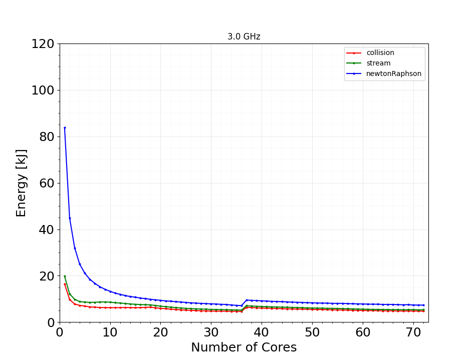
    <figcaption>Energy versus number of core count for selected hotspots at 3.0 GHz</figcaption></center>
</figure>

<figure>
    <center>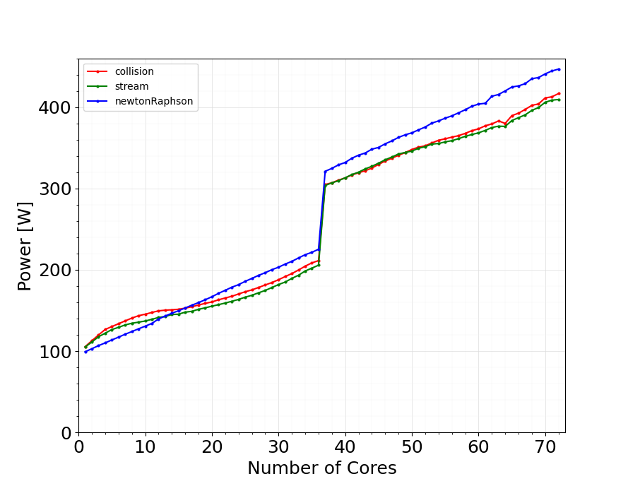
    <figcaption>Power versus number of core count for selected hotspots at 2.4 GHz</figcaption></center>
</figure>

## 7. Task6: Discussion of hot spot measurements

The following remarks can be drawn from the results obtained in Task 5. 

* According to the strong scaling results as shown in figure 11, `collision` and `streaming` kernels show a saturation in 1<sup>st</sup> NUMA domain and thereafter scales linearly across the node. Furthermore, `newtonRaphson` kernel does not show any saturation across the node. However, `newtonRaphson` kernel has the lower `MLUP/s` compared to both the other top hotspots.
* As shown in figure 12, the memory bandwidth for the top 2 hotspots saturates at 1<sup>st</sup> NUMA domain, while `newtonRaphson` does not seem to have any saturation. Usually, the strong scaling trends and the memory bandwidth scaling runs have the similar characteristic. However, according to the results there is a slight discrepancy between strong scaling trends and the memory bandwidth for `streaming.`
* One of the reasons for both the above points may be the usage of `MLUP/s` as the performance metric. Because, it is obvious that the total runtime is much greater than the hotspot runtime for 2.7 billion lattice updates, and therefore `MLUP/s` has higher values for hotspots. Maybe the `Flop/s` is a realistic metric for this comparison. However, we cannot use this, because then we cannot put stream kernel for the comparison, since it does not have any floating-point operations.
* All three selected hotspots contribute 9% - 16% to the main energy measurements. 
* `newtonRaphson` has the highest contribution while showing a scalable performance within the node. Furthermore, all the hotspots seem to follow the same energy trend as the energy rend of the whole application, as discussed in the Task 2.
* Both the highest hotspot ranks seem to have similar variation in terms of power dissipation.  
<br>
To further investigate the capabilities of the present CLBM implementation, an empirical roof-line model is constructed [6]. Here, the DP, double precision `Flop/s` is taken as the performance metric. Further, the position of the whole application along with selected hotspots is placed in the roof-line diagram. However, it is worth noting that the streaming kernel does not have any `Flop/s`. Therefore, it is not included here. In the roof-line diagram, the Maximum horizontal roof is related to the AVX `Flop/s` and maximum data throughput is related to the `load_avx`. For all the measurements, the functionalities of `likwid-bench` is utilized. 
<!-- <br>
<br>
<br>
<br>
<br>
<br>                                
<br>
<br>
<br>
<br>
<br>
<br>                                
<br>
<br>
<br>
<br>
<br>
<br> -->

<figure>
    <center>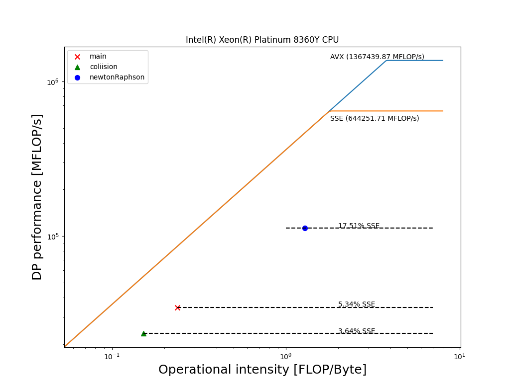
    <figcaption>Roof-line diagram</figcaption></center>
</figure>
<!-- <br>
<br>
<br> -->
According to the roofline diagram, it is evident that the most realistic maximum horizontal roof for the CLBM application would be the line related to the `SSE` `Flop/s`. The whole application shows approximately 5.34% percent performance of the maximum horizontal `SSE` roof. Further, the whole application and the selected hotspots are close to memory bound, which is the typical scenario of the most LBM implementations.  
Moreover, the usage of AVX is limited for the present CLBM implementation, even though the required compiler optimizations have incorporated. May be one of the reasons for this is the usage of the GNU g++ compiler. However, the attempts to use the intel compiler were not successful due to the dependency of GNU scientific library in the implementation.  
To conclude, the studied shock tube case with CLBM shows scalable performance, and it shows one of the main advantages of using LBM schemes, which is the natural adaptability to parallel processes computing [8]. Further, the Solver is close to memory bound. According to the roofline analysis, the application has arbitrary horizontal roofs. Therefore, maybe there are more opportunity to increase bandwidth utilization, for example by using SIMD instructions in the newtonRaphson routine.  
One of the primary focuses of this study is to understand the behaviour of energy and power dissipation of the application. According to the analysis, the optimal energy can be observed at the first socket in Fritz node considering 1.8 GHz, 2.0 GHz, 2.2 GHz and 2.4 GHz and EDP results verified it. However, DRAM energy contribution to the total energy is around 5%-11%, and it has comparatively less impact on the total energy consumption. Further, the root finding scheme has less significance in terms of performance, even though the root finding algorithm was the highlight in previous literature regarding, this LBM regime. According to the authors' knowledge this is first kind of extensive benchmarking study related to compressible DDF-LBM. 
<br>

## Reference

1. **The Landscape of Parallel Computing Research A View from Berkeley, 2006 Electrical Engineering and Computer**
Sciences, University of California at Berkeley, Electrical Engineering and Computer Sciences, University of
California at Berkeley.
2. Ayesha Afzal, **The Cost of Computation: Metrics and Models for Modern Multicore-based Systems in Scientific Computing**, Master thesis, July 2015, DOI: 10.13140/RG.2.2.35954.25283
3. Jonas Latt, Christophe Coreixas, Joël Beny, and Andrea Parmigiani. **Efficient supersonic flow simulations using lattice boltzmann methods based on numerical equilibria**. Philosoph ical Transactions of the Royal Society A:Mathematical, Physical and Engineering Sciences,378(2175):20190559, jun 2020. 5.
4. <https://blogs.fau.de/hager/archives/tag/energy>
5. Ayesha Afzal,Georg Hager,Gerhard Wellein,**SPEChpc 2021 Benchmarks on Ice Lake and Sapphire Rapids Infiniband Clusters: A Performance and Energy Case Study, SC-W '23: Proceedings of the SC '23 Workshops of The International Conference on High Performance Computing, Network, Storage, and Analysis**,November 2023, Pages 245–1254,https://doi.org/10.1145/3624062.3624197
6. <https://github.com/RRZE-HPC/likwid/wiki/Tutorial:-Empirical-Roofline-Model>
7. <https://github.com/RRZE-HPC/likwid/wiki/TutorialMarkerC>
8. Timm Krüger, Halim Kusumaatmaja, Alexandr Kuzmin, Orest Shardt, Goncalo Silva, and Erlend Magnus Viggen. **The Lattice Boltzmann Method**. Springer International Publishing, 2017.  

## Appendix


